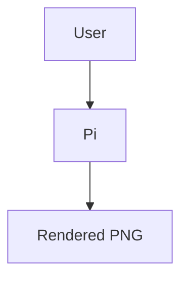

# pi-mermaid-render

Pi agent extension that automatically detects fenced Mermaid diagrams in assistant messages (```mermaid blocks), renders them to PNG via `@mermaid-js/mermaid-cli` (`mmdc`), and shows them in Pi’s transcript.

- Renders to: `/tmp/pi-mermaid-renders/*.png` (files are kept; no auto-cleanup)
- Transcript UX:
  - Collapsed: preview image + clickable link
  - Expanded: file URI, original Mermaid source, and full error output (if render failed)
- If rendering fails, it also inserts a troubleshooting prompt into Pi’s editor so you can quickly ask the agent to fix the diagram.

## Install

### Global install

```bash
pi install git:github.com/canadoce/pi-mermaid-render
# then in Pi:
/reload
```

### Pin a version/tag

```bash
pi install git:github.com/canadoce/pi-mermaid-render@v0.1.0
```

### Project-local install (writes to .pi/settings.json)

```bash
pi install -l git:github.com/canadoce/pi-mermaid-render
```

## Usage

Just ask the model to output a Mermaid diagram:



The extension will:
1. extract all ` ```mermaid ... ``` ` blocks from the assistant message
2. render each to a PNG via `mmdc`
3. emit a custom transcript message with the rendered image and a `file://…` link

Multiple diagrams in one assistant message are supported and labeled like `(1/3)`, `(2/3)`, …

## Terminal image support

Pi’s `Image` component will render inline images in supported terminals (Kitty, Ghostty, iTerm2, WezTerm, …). If your terminal can’t display images inline, you can still open the saved PNG using the emitted `file://…` link.

## Notes / Troubleshooting

- `@mermaid-js/mermaid-cli` uses Puppeteer/Chromium. The first install can take a bit (Chromium download).
- This extension writes a Puppeteer config file to:
  - `/tmp/pi-mermaid-renders/puppeteer-config.json`
  - with `--no-sandbox` / `--disable-setuid-sandbox` to improve compatibility in restricted environments.

## Development

```bash
git clone https://github.com/canadoce/pi-mermaid-render
cd pi-mermaid-render
npm install

# Try without installing permanently
pi -e .
```

## Security

Pi extensions run with your full system permissions. Review code before installing third-party packages.
