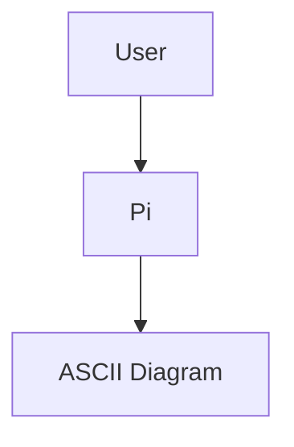

# pi-mermaid-render

Pi agent extension that automatically detects fenced Mermaid diagrams in assistant messages (```mermaid``` blocks), renders them as ASCII/Unicode diagrams with [`beautiful-mermaid`](https://www.npmjs.com/package/beautiful-mermaid), and shows them directly in Pi’s transcript.

- Renders with `beautiful-mermaid` in isolated worker threads — no `mmdc`, Chromium, or Puppeteer
- Transcript UX:
  - Collapsed: summary + compact preview of the first successfully rendered diagram
  - Expanded: all diagrams from that assistant message stacked in a single grouped transcript entry
  - Failed diagrams show diagnostics and original Mermaid source in expanded view
- Mermaid rendering is queued in the background so Pi stays responsive even if a diagram is slow or broken
- Mermaid transcript entries are kept visible in the session transcript/history, but filtered out of normal LLM context so future turns do not see the rendered ASCII output
- If rendering fails, it also inserts a troubleshooting prompt into Pi’s editor so you can quickly ask the agent to fix the diagram yourself

## Install

### Global install

```bash
pi install git:github.com/canadoce/pi-mermaid-render
# then in Pi:
/reload
```

### Pin a version/tag

```bash
pi install git:github.com/canadoce/pi-mermaid-render@v0.1.0
```

### Project-local install (writes to .pi/settings.json)

```bash
pi install -l git:github.com/canadoce/pi-mermaid-render
```

## Usage

Just ask the model to output a Mermaid diagram:



The extension will:
1. extract all ` ```mermaid ... ``` ` blocks from the assistant message
2. render each to ASCII/Unicode with `beautiful-mermaid`
3. emit a single grouped custom transcript message for that assistant message
4. keep that transcript entry visible in session history, while excluding it from future LLM context

If one assistant message contains multiple Mermaid blocks, they stay grouped together:
- collapsed: summary + first preview
- expanded: all diagrams stacked in order

## Notes / Troubleshooting

- Rendering uses `beautiful-mermaid`’s synchronous `renderMermaidASCII()` API inside worker threads.
- ASCII output is tuned for Pi transcript density with compact spacing (`paddingX: 1`, `paddingY: 1`, `boxBorderPadding: 0`).
- Output is rendered as plain text in the transcript, so it works in any terminal supported by Pi.
- Each diagram render runs with a timeout in the worker. If a render hangs or crashes, it is marked as failed and Pi remains usable.
- On failure, the extension preserves the original Mermaid source and full diagnostics in the expanded transcript entry.
- Mermaid render transcript entries are filtered out in Pi’s `context` hook, so they stay visible in transcript/session history without being forwarded to future model calls.
- Rendering failures are **not** sent automatically to the LLM. Instead, the extension appends a troubleshooting prompt to Pi’s editor so you can decide whether to ask the model to fix the diagram.

## Development

```bash
git clone https://github.com/canadoce/pi-mermaid-render
cd pi-mermaid-render
npm install

# Try without installing permanently
pi -e .
```

## Security

Pi extensions run with your full system permissions. Review code before installing third-party packages.
